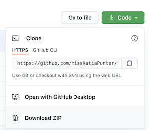

# APIs and how the Internet works

Every page on the internet is stored somewhere on a remote server.
When you type [www.github.com](https://github.com/) into your browser, a request goes out to GitHub’s remote server.
The server then sends a response.
Your browser, also known as the client, receives the response, interprets the code and displays the page.
This means that every time you visit a page on the Web, you interact with some remote server’s API.
An API is the part of the server that receives requests and sends responses.
API stands for Application Programming Interface.
It's a set of public methods and properties uses to interact with others via your application.

## Frontend, backend

The terms frontend and backend refer to the separation of concerns between the presentation
and the data that is permanently stored on the server.

The frontend code is also stored on the server but it is interpreted by the browser, the client.

The backend deals with things such as customer and product data stored in the database.

However, some organisations allow frontend developers use their backend services and this is called open APIs.


## Explore DOG CEO API

API sounds like a kind of beer.
Software developers often order API in pubs.
Bartenders respond was a 404: resource not found.

[DOG CEO](https://dog.ceo/dog-api/) is an example of an open API.

What you can do is make a website.
Write some frontend code (HTML, CSS, JS) and use the services of [DOG CEO](https://dog.ceo).

The services they provide are: pictures of dogs of different breeds.

Before you go and have a look at how [DOG CEO](https://dog.ceo) deliver pictures of dogs to frontenders
make sure you have a browser extension called JSON Viewer.

Here is one:

[Get a json viewer](https://chrome.google.com/webstore/detail/json-viewer/gbmdgpbipfallnflgajpaliibnhdgobh/related)

Now let us have a look at the list of all dog breeds from Dog CEO:

[All breeds](https://dog.ceo/api/breeds/list/all)

A url such as ([All breeds](https://dog.ceo/api/breeds/list/all)) is known as a route. What we just saw was the route that lists all breeds.

In today's activity we will use a much simpler route. Let's see it as a JSON:

[Random breed](https://dog.ceo/api/breeds/image/random)

## Promises, promises

To connect to route [Random breed](https://dog.ceo/api/breeds/image/random) that Dog CEO API generously gives us
with no charge and no API keys we will use a new JS feature called [Fetch API](https://developer.mozilla.org/en-US/docs/Web/API/Fetch_API/Using_Fetch).

[Fetch API](https://developer.mozilla.org/en-US/docs/Web/API/Fetch_API/Using_Fetch) allows us
to send a request to an API, go perform some other tasks, for example DOM rendering and visualising our beutiful frontend code,
and then do things with the data our fetch request brought back when it comes back.

This is known as asynchronous code.

Fetch uses Promises. Oh no, more terms! Let's learn about Promises with the Free Code Camp.

[Write some promises with Free Code Camp](https://www.freecodecamp.org/learn/javascript-algorithms-and-data-structures/es6/create-a-javascript-promise)

[A promise from codewars](https://www.codewars.com/kata/5b61d6ef07a266d40b000097/train/javascript).

## Things to do with this repo

1. Clone the repo. To do it from the terminal navigate to your workplace folder and run:

```bash
git clone git@github.com:missKatiaPunter/fetch-intro.git
```

Alternatively, you can download the zipped folder:



2. Navigate into the cloned folder:

```bash
cd fetch-intro
```

3. Open it in VSCode or an editor of your choice

4. Have a look at the code. Comment what you can understand and prepare questions

5. What does [line 30 in index.html](https://github.com/missKatiaPunter/fetch-intro/blob/main/index.html#L30) do?
Make sure to comment it.

6. What about [line 1 in index.js](https://github.com/missKatiaPunter/fetch-intro/blob/main/index.js#L1)?
Make sure to comment it.

7. Run the project on your local. You may want to get the Live Server extension for this.

8. Uncomment [line 46 in index.js](https://github.com/missKatiaPunter/fetch-intro/blob/main/index.js#L46).
Run and check what it does.

9. Somewhere aroun line 47 add an event listener to the button's event click:

```js
submitButton.addEventListener("click", onFetchDog);
```

`onFetchDog` is an optional function name, use any name(identifier) you like

10. Anywhere above line 46 add a function definition for your event handler, e.g.:

```js
const onFetchDog = e => {

}
```

11. Print something into the console from function `onFetchDog` or whatever you called is:

```js
const onFetchDog = e => {
    console.log("here we will be getting dogs");
}
```

12. You probably need to add [`event.preventDefault()`](https://developer.mozilla.org/en-US/docs/Web/API/Event/preventDefault)

```js
const onFetchDog = e => {
    e.preventDefault();
    console.log("here");
}
```

13. Now let's write our fetch function. To start:

```js
const onFetchDog = e => {
    e.preventDefault();
    console.log("here");
    fetch('https://dog.ceo/api/breeds/image/random')
        .then(res => res.json())
        .then(res => console.log(res));
}
```

14. Now you should see the result of your fetch in Inspect Element.

15. Make some function calls and finish your site. If you want your own Dogle site I am afraid you need your own repo and to re-write my code.